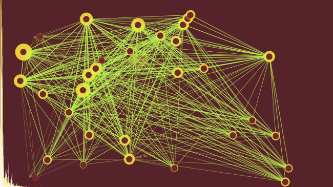
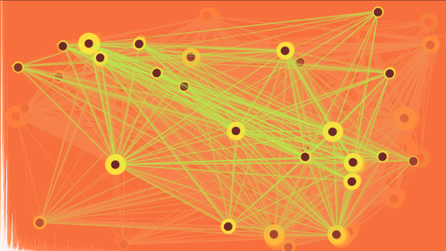

SGVisualizer
============



This project is really old (from my freshman year of college) but I fired it up with [Processing 2.2.1](http://processing.org/) and was surprised to find that it still runs.

This code was part of a project for visualizing and creating music from computer network data. I wrote a music visualizer in the meantime, and we ended up using it in the final project with some statically-generated music files that the other guys worked on. Since it was just a bit of a tech demo, and not really a polished product, you can't change the audio file that's used for rendering at runtime.

Launching
---------

The file `waveform.wav` is used for audio playback and visualization. If you add a file with that name to this directory, then the code will run with that sound file.

If you have a waveform you'd like to run this on, and you've set it up by putting a `waveform.wav` in this folder, then you can launch the code by running
```
processing SGVisualizer.pde
```
as long as `processing` is in your `$PATH`.

How it works
------------



The visualizer does a [Fast Fourier transform](http://en.wikipedia.org/wiki/Fast_Fourier_transform) on its input, and uses the values from that to get a sense of what the music's doing. Certain values can trigger things like a new node creation, or the clearing of the screen. You can see the FFT in the background of the images also, rendered in the bottom left.

The individual nodes are objects from [Circle.pde](./Circle.pde) and they're managed by the creatively named [CircleManager.pde](./CircleManager.pde). The rest of the drawing happens in [SGVisualizer.pde](./SGVisualizer.pde).

Future
------

I've long since abandoned writing Processing code, partly out of a distaste for how their Java interface is rendered on my system, so don't expect any real improvements. The code is [MIT licensed](./LICENSE.txt), however, so you're free to do what you want with it.

One interesting project would be to port this to JavaScript, where it might see a better reception than a version requiring some custom Java libraries and IDE. [Processing now supports that](http://processingjs.org/), so it might not be very hard.
